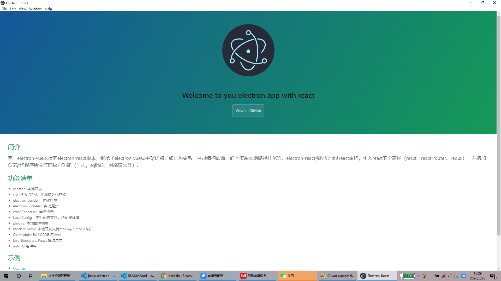
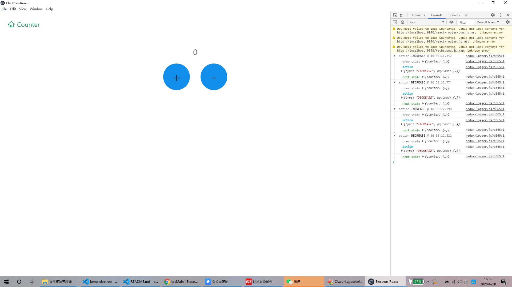
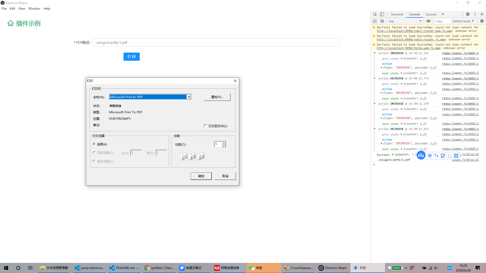

# electron-react

基于electron-vue改造的electron-react版本，继承了electron-vue脚手架优点，如：热更新、目录结构清晰、静态资源本地路径转化等。electron-react视图层通过react重构，引入react的全家桶（react、react-router、redux），并增加C/S架构程序所关注的核心功能（日志，sqlite3，网络请求等）。

> 此版本是基于`electron-vue`进行改造。为什么不直接使用[https://github.com/electron-react-boilerplate/electron-react-boilerplate](https://github.com/electron-react-boilerplate/electron-react-boilerplate)呢？有以下几个原因。
>- 目录结构不清晰：直接run build 会在src目录中生成临时文件，感觉很不友好。
>- TS语法：对于非通用项目，TS语法反而增加开发工作量。
>- 使用过electron-vue 觉得项目结构清晰，使用起来方便。

# 功能清单

- sqlite3 & ORM：本地持久化存储
- electron-builder：构建打包
- electron-updater：自动更新
- crashReporter：崩溃报告
- LocalConfig：本机配置文件，适配多环境
- plugins: 本地插件调用
- mock & proxy: 本地开发支持mock与非mock请求
- CssModule: 解决CSS命名冲突
- ErrorBoundary: React 错误边界
- antd: UI组件库

# 示例

- Counter示例：一个完整的redux示例，会在console中记录每次状态更新日志。
- plugin 示例：调用本地插件打印PDF文件示例

# 效果图

- 首页

- Counter

- Plugin

